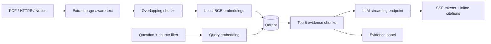

# Atlas — answers with evidence

A single-owner RAG workspace for PDFs, web pages, and Notion. FastAPI serves an accessible responsive interface, Qdrant stores vectors, local FastEmbed embeddings retrieve evidence, and an OpenAI-compatible endpoint streams cited answers. Click a citation to inspect the exact retrieved chunk and PDF page.

## Run locally

Requires Python 3.12. From this directory:

```sh
python -m venv .venv
# Linux/macOS: source .venv/bin/activate
# Windows: .venv\Scripts\Activate.ps1
pip install -r requirements.txt
```

For a completely offline demo after dependencies are installed, set `DEMO_MODE=1` and run `uvicorn app.main:app --port 7860`. On PowerShell use `$env:DEMO_MODE='1'`. Open http://localhost:7860. This mode uses deterministic word hashing and streams retrieved excerpts; **it does not perform semantic embedding or LLM generation**.

For real RAG, leave `DEMO_MODE` unset, set `ADMIN_TOKEN`, `LLM_API_KEY`, `LLM_BASE_URL` and `LLM_MODEL`, then launch the same command. FastEmbed downloads `BAAI/bge-small-en-v1.5` on the first run. Use a 384-dimensional embedding model with the current collection configuration. Environment variables are read directly; `.env.example` is documentation and is not automatically loaded.

Enter your owner token through **Owner access** in the app. Upload a PDF or ingest a URL/Notion page, then ask a question. Selection checkboxes narrow retrieval. An empty selection searches all accessible sources. Each question is independent; visible chat history is not used for retrieval or generation.

## Hugging Face deployment

1. Check account eligibility before creating a public **Docker Space**. Current Hugging Face docs say Docker Space creation requires a paid plan, although CPU Basic has no hourly charge. Do not assume new accounts can host this for free.
2. Upload this directory, including the Dockerfile and README YAML metadata.
3. For a no-key public demonstration, set the Space variable `DEMO_MODE=1`.
4. For semantic retrieval, remove `DEMO_MODE`. Set secrets `ADMIN_TOKEN`, `LLM_API_KEY`; set variables `LLM_BASE_URL` and `LLM_MODEL` for your compatible inference provider. A free tier may work but is subject to that provider's current quota.
5. Set `QDRANT_URL` and secret `QDRANT_API_KEY` for durable remote storage. Local `/app/data` is ephemeral on hosting without durable storage. Never promise persistence across Space rebuilds.
6. Optionally set secret `NOTION_TOKEN`, then share desired pages with that Notion integration.
7. Open the Space URL, check `/api/health`, ingest a small document, and verify a cited answer before sharing it.

Public visitors can browse and query the sample corpus in demo mode. Uploaded documents require owner access. Live LLM generation requires owner access by default. Set `PUBLIC_LLM_DAILY_LIMIT=20` to allow a shared daily budget of 20 sample-corpus answers for visitors. This counter is process-local and resets on restart; it is not a billing guarantee. Configure provider-side limits too. Do not post the owner token on LinkedIn. Public questions never retrieve private documents.

## Pipeline



Stable content-derived IDs deduplicate identical ingestions. Updated content creates a new document; remove the old version manually. PDF page metadata stays with each chunk. Notion walks nested, paginated blocks; unsupported media and database contents are not extracted. Web ingestion extracts server-rendered HTML, not JavaScript applications. Scanned PDFs require external OCR.

## Checks and limits

Run `python -m pytest -q`. Tests exercise chunk boundaries, blocked URLs, deduplication, deletion, visibility filters, HTTP authorization, SSE, and empty evidence. These are offline integration checks, not a semantic quality benchmark. Run `python scripts/evaluate.py` to measure real semantic retrieval against the small included fixture. Do not present the fixture as representative accuracy.

This is a production-oriented portfolio MVP, not an audited multi-tenant production service. It includes input limits, owner authentication, safe text rendering, a process-local rate limiter, API docs at `/docs`, health status, request IDs, failure events, and latency logs. There is no durable job queue, distributed throttling, automatic sync, OCR, reranker, observability backend, backup automation, or service-level guarantee. Ingestion is serialized in-process; deploy one worker. PDF parsing needs process isolation and memory/CPU limits for hostile files. URL DNS checks must be backed by network-level egress controls to address DNS rebinding. Prompt instructions and citations cannot guarantee factual correctness or prevent all prompt injection.

Official references: [Hugging Face Docker Spaces](https://huggingface.co/docs/hub/spaces-sdks-docker), [Qdrant FastEmbed](https://qdrant.tech/documentation/fastembed/fastembed-semantic-search/), [Notion page content](https://developers.notion.com/guides/data-apis/working-with-page-content).

## Free hosting alternative

The included `render.yaml` deploys the offline demo on a Render Free web service from a Git repository. Render documents free instances with 512 MB RAM and idle sleep after 15 minutes, so cold starts are expected. The full local embedding model may exceed that memory budget: semantic mode on this tier requires measurement before promising reliability. Use durable remote Qdrant for real documents. [Render free service limits](https://render.com/docs/free).

Groq offers an OpenAI-compatible endpoint at `https://api.groq.com/openai/v1` and a rate-limited free tier. Set `LLM_API_KEY` to your Groq key and `LLM_MODEL` to a currently supported model from your console. Do not put keys into client code. [Groq API](https://console.groq.com/docs/api-reference), [free plan limits](https://console.groq.com/docs/rate-limits).
